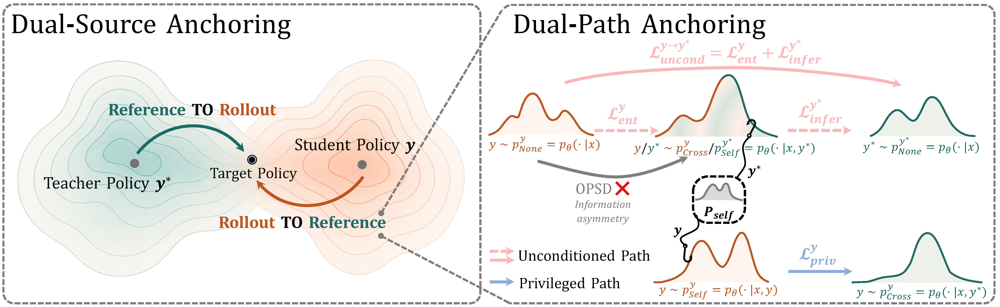

<div align="center">

# Dual-Anchored Policy Distillation

**DAPD aligns on-policy and reference behavior under matched information conditions.**

</div>

<p align="center">
  
</p>

## Overview

On-policy self-distillation can strengthen a teacher with a reference completion, but the teacher and student then have access to different information. This information asymmetry can cause **privilege illusion**, where the student behaves as if reference information seen during training were still available at inference.

DAPD addresses this problem through:

- **Dual-Path Anchoring (DPA):** aligns rollout and reference behavior both without privileged information and when it is available to both distributions.
- **Dual-Source Anchoring (DSA):** combines reference-to-rollout and rollout-to-reference supervision.

## Installation

```bash
python -m pip install -r requirements.txt
```

The code is tested with Python 3.10, PyTorch 2.8.0, Transformers 4.57.1, DeepSpeed 0.18.2, and vLLM 0.11.0.

## Data

The exact reasoning training split used in our experiments is included at
`data/reasoning_train.parquet`. It contains 29,434 examples from the
OpenThoughts math domain, retaining the original `problem`/`solution` rows and
order.
The training script also accepts another local Parquet file or Hugging Face
dataset containing `problem` and `solution` columns.

## Training

```bash
CUDA_VISIBLE_DEVICES=0,1,2,3 \
MODEL_PATH=/path/to/Qwen3-4B \
DATASET=data/reasoning_train.parquet \
OUTPUT_DIR=outputs/dapd-qwen3-4b \
bash scripts/train_reasoning.sh
```

The default launcher uses four processes and an effective batch size of 32. Checkpoints are saved every 50 optimizer steps as standard PEFT adapters.

## Performance

The main comparison uses task-specific Qwen3-4B models. The overall score is
the unweighted mean over the six reported benchmarks.

| Method | AIME24 | AIME25 | HMMT25 | LCB v5 | BFCL v3 | IFBench | Avg. |
| --- | ---: | ---: | ---: | ---: | ---: | ---: | ---: |
| Base | 75.56 | 65.56 | 42.50 | 52.11 | 61.38 | 29.67 | 54.46 |
| OPSD | 76.67 | 67.78 | 43.33 | 52.26 | 61.32 | 30.67 | 55.34 |
| **DAPD** | **77.22** | **72.22** | **46.39** | **53.31** | **61.91** | **33.00** | **57.34** |

For reasoning, Avg@12 is the unweighted mean of AIME24, AIME25, and HMMT25.

| Scale | Base | OPSD | **DAPD** | DAPD gain over OPSD |
| --- | ---: | ---: | ---: | ---: |
| 1.7B | 36.85 | 42.04 | **43.98** | +1.94 |
| 4B | 61.20 | 62.59 | **65.28** | +2.69 |
| 8B | 65.00 | 65.00 | **67.41** | +2.41 |
| 14B | 68.80 | 68.89 | **70.93** | +2.04 |
| 32B | 70.00 | 70.28 | **73.06** | +2.78 |

See the [paper](https://arxiv.org/abs/2608.01735) for benchmark protocols and
additional ablations.

## Project Structure

```text
data/reasoning_train.parquet Exact reasoning training split
dapd/data.py               Prompt construction and data collation
dapd/objective.py          DAPD objectives and weights
dapd/trainer.py            Training, snapshots, and rollout synchronization
scripts/train_reasoning.sh Distributed training launcher
train.py                   Training entry point
```

## Citation

```bibtex
@misc{wu2026dapddualanchoredpolicydistillation,
  title={DAPD: Dual-Anchored Policy Distillation},
  author={Jianyu Wu and Yizhou Wang and Encheng Su and Chen Tang and Shixiang Tang},
  year={2026},
  eprint={2608.01735},
  archivePrefix={arXiv},
  primaryClass={cs.AI},
  url={https://arxiv.org/abs/2608.01735},
}
```
